# Appendix — what is in it, and the detail behind each decision

Nobody has to read this. [`NOTE.md`](NOTE.md) is the page; [`TOUR.md`](TOUR.md)
is where to look. This is for whichever decision you want to argue with.

Part A is what a client would notice, grouped by moment. Part B is why.

---

# Part A — What is in it

## Start

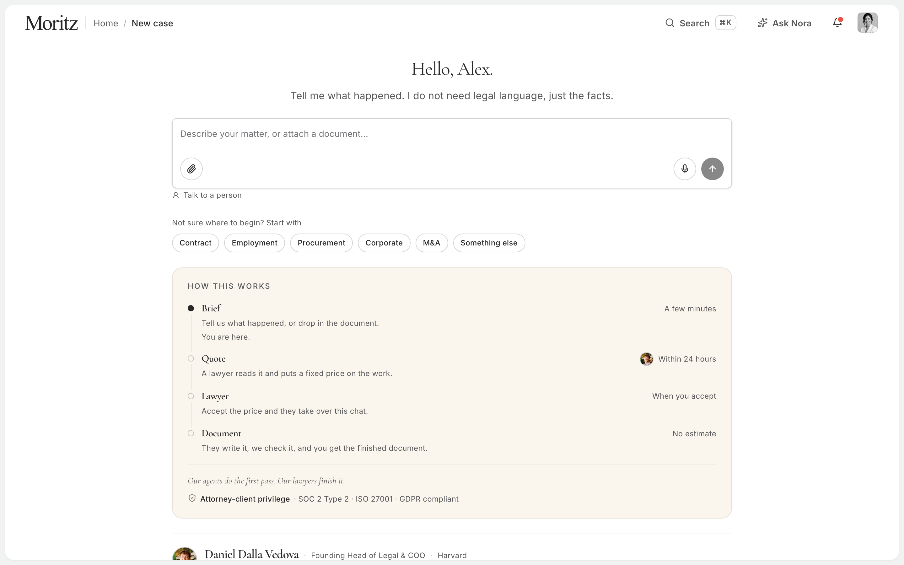

- One composer: type in your own words, drop a file, or dictate. The
  placeholder rotates through three real examples until you focus it.
- Matter chips, each with a one-line hint on hover and for screen readers,
  because "Procurement" alone tells a founder nothing. "Something else" is
  always one of them.
- **How this works**: four steps — Brief, Quote, Lawyer, Document — with who
  does each and when. Brief's dot is filled; you are here. The lawyer on the
  Quote row is a real person who prices this kind of matter, and changes when
  the matter type does.
- That card becomes the rail when you start typing. Same words, same dots,
  same line, slid into the left margin.
- One lawyer's face, name, role and school, and one way to reach them:
  _Talk to a person_.

  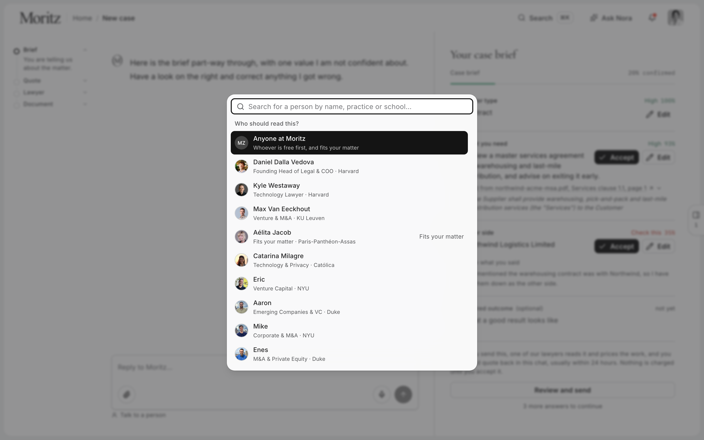

- Dictation says what the microphone costs — the audio leaves the browser —
  in one sentence, while it is running.

## Describe

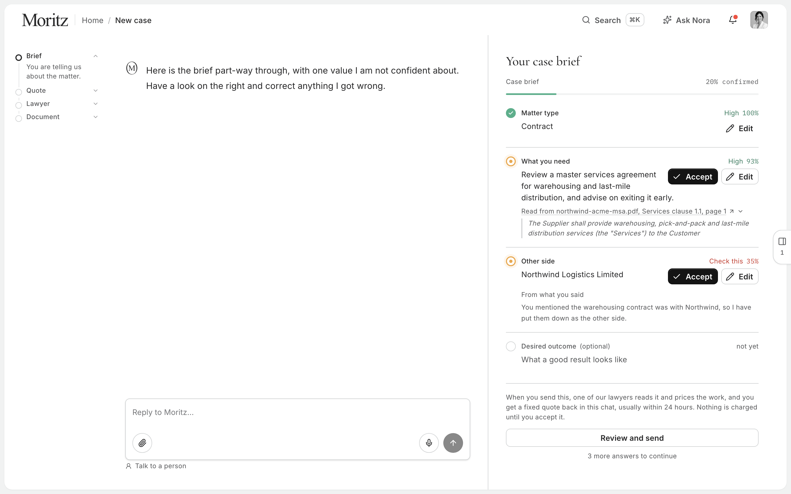

- The model runs the conversation; the code owns the brief. The per-matter
  field lists are data. The model chooses what to ask next; the code decides
  when nothing required is missing.
- Every reply streams, and every reply reports what it did: "One step",
  "2 steps", opening to how many documents were read, how many values traced
  to a line, how many fields were written.
- The brief fills in beside the chat as facts are understood. Four field
  states, all visible at once: confirmed, unsure, asking now, not yet.
- A value read from a document carries the passage it came from — the clause
  with the heading above and the clause below, cut verbatim from the PDF's own
  text layer, the quoted line highlighted, never more than three sentences.
  Click it and the document opens at that page with the passage marked.

  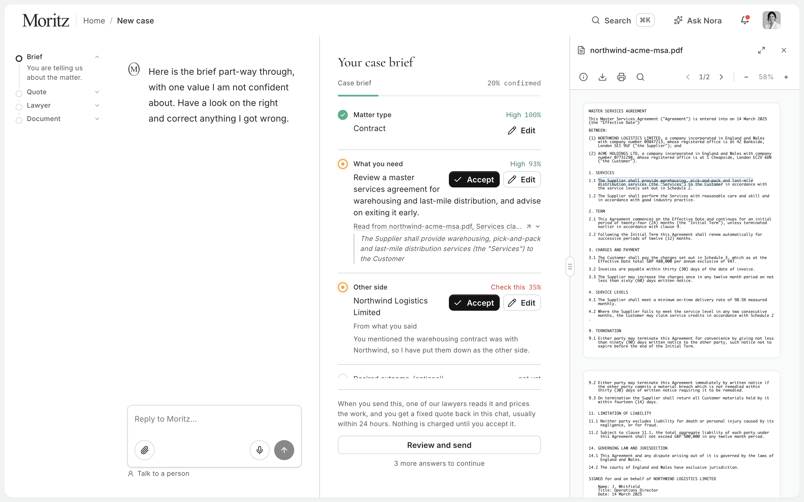

- A value the model inferred carries one line of why, in the second person.
- Every value is confirmed or edited before it can leave. Confirm draws a
  tick; edit expands the row in place with a save and a discard.
- Confusion is handled. "I don't understand what you mean" produces zero
  field updates and a rephrased question, three times in a row if it has to.
- The other side is withheld unless the model can trace it to something you
  said. A contract that names two companies is not enough; the code makes
  Moritz ask.
- The matter title is chosen from the brief, not from your first sentence.
- The count line under each reply never contradicts the reply above it. When
  a question is in flight it says "anything else is optional", not "nothing
  left to ask".

## Upload

- Drop anywhere on the page; the whole page dims and a border draws itself.
  Or the paperclip, or paste.
- Several files at once, read together in one call.
- The chip carries the file's own icon and colour — PDF red, Word blue — from
  the same helper the case pages use.
- A thin line under the chip while it is read. Then the fields it answered
  fill in as a cascade, top to bottom.
- Rejected files shake once, gently, and say why. Only types that make sense
  are accepted. Nothing dropped can destroy the session.
- Documents dropped after Send go straight to the team pricing the case, and
  the screen says so.

## Progress

- One rail, always visible: Brief, Quote, Lawyer, Document. No step numbers.
  The active step opens to its substeps; the rest stay one line.
- On a big screen it is its own column at the far left. Below 1280px it lies
  down into a bar at the top and opens on a tap. On a phone it is a sheet.

  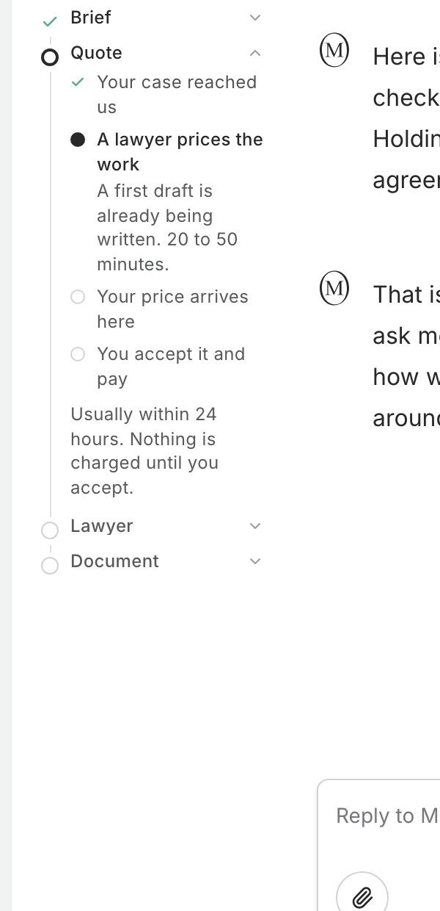
  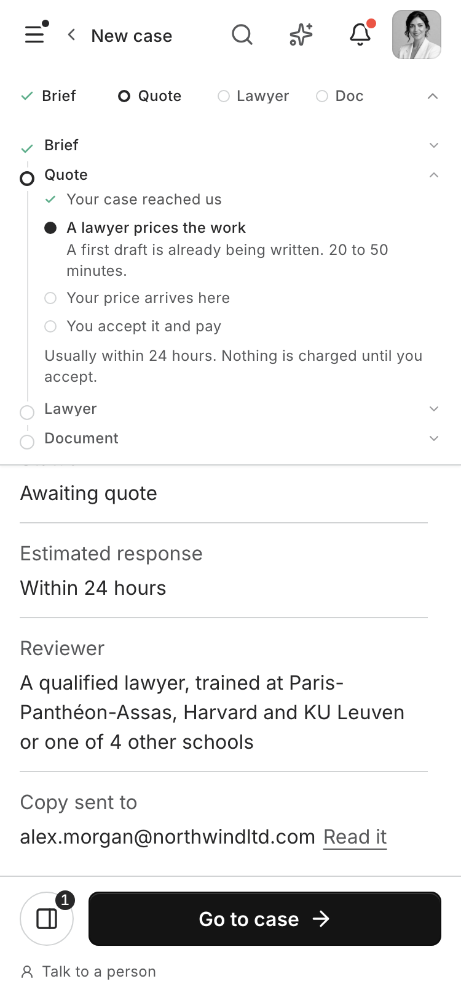

- The progress bar counts confirmed facts. A document that answers four
  fields moves it four.
- Every wait is named, listed in one file, and driven by a response arriving.
  Nothing anywhere is on a timer. A test fails the build if two waits share a
  sentence or a step appears that no listed wait produced.
- The three ticking lines after Send are your own three steps: checking
  nothing is missing, writing up the notes, handing them over.

  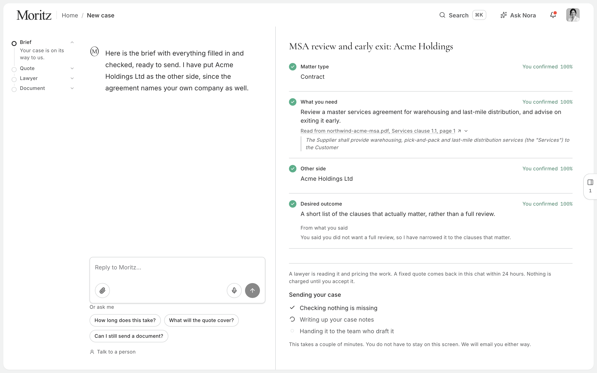

- "Review and send" fills black left to right when the last field is
  confirmed. Pressed early, it points: the unconfirmed row pulses and scrolls
  into view, and a screen reader hears why.
- Press Send and the button contracts to a dot that rises into the rail and
  becomes Brief's filled circle.

## Sent

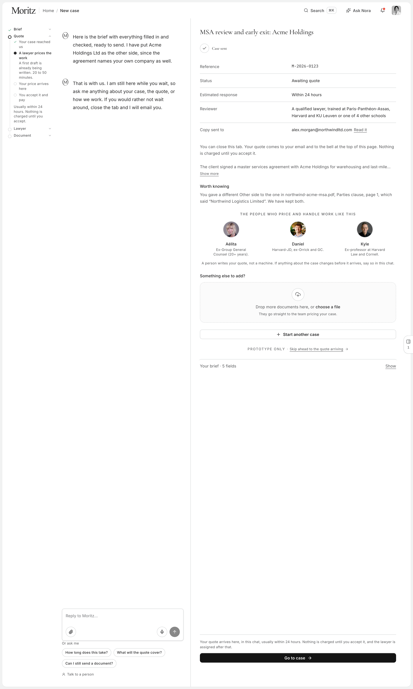

- A receipt: reference, status, estimated response, reviewer, and where the
  copy was emailed. Focus moves to it; a screen reader hears "Case sent" once.
- The rail's Brief step ticks and Quote opens: your case reached us, a lawyer
  reads it and prices the work — with the drafting fact on that row — your
  price arrives in this chat, you accept and pay. Three more rows fold behind
  one click. Only the quote has a time on it.
- "You can close this tab. Your quote comes to your email and to the bell."
  True because both exist.

  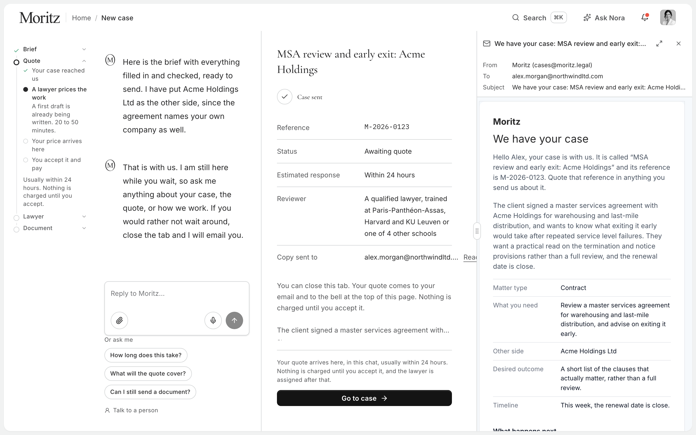

- The people who price and handle work like this: three faces, readable on
  press — name, role, credential, school.
- Something else to add: a drop zone that goes to the pricing team.
- One request, if there is one worth making: a case with no document is asked
  for the document; a case with no stated outcome is asked what a good result
  looks like; a case with neither is asked nothing.
- The summary and the full brief are folded by default. The screen ends at
  _Go to case_ and _Start another case_.
- Refresh and it is still there. Navigate away during the wait and the case
  is still recorded.

## After

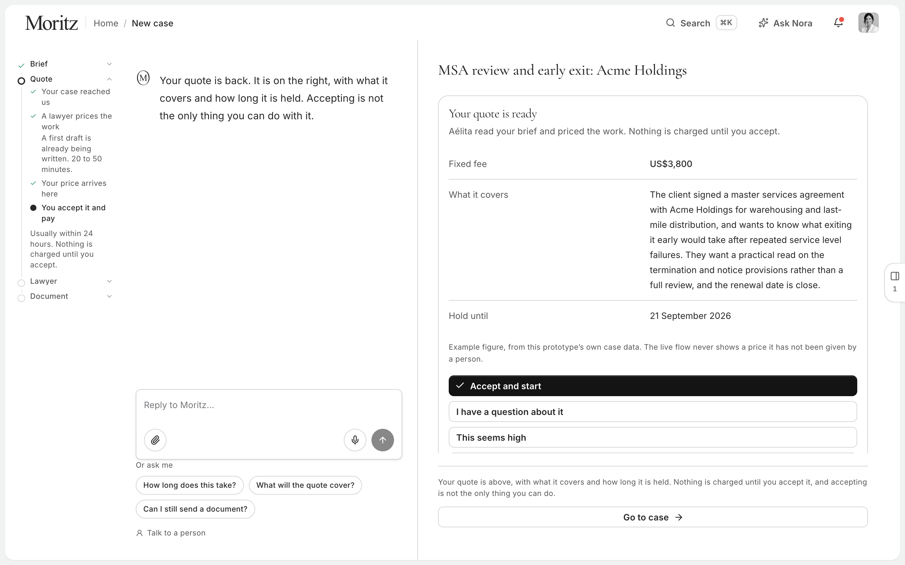

- The agent stays available, on a second prompt that collects nothing,
  answers where the case is and what the quote covers, refuses to price or
  assess, and offers the person when it does not know. Three tappable
  questions it can answer completely.
- The quote, behind a labelled prototype control: fixed fee, what it covers,
  how long it is held, and four ways to answer. Accept is the only solid
  button. "This seems high" asks which of four things it is, and three of
  them are briefs for the lawyer's next move. "Quote me for part of it" offers
  the brief's own filled fields.

  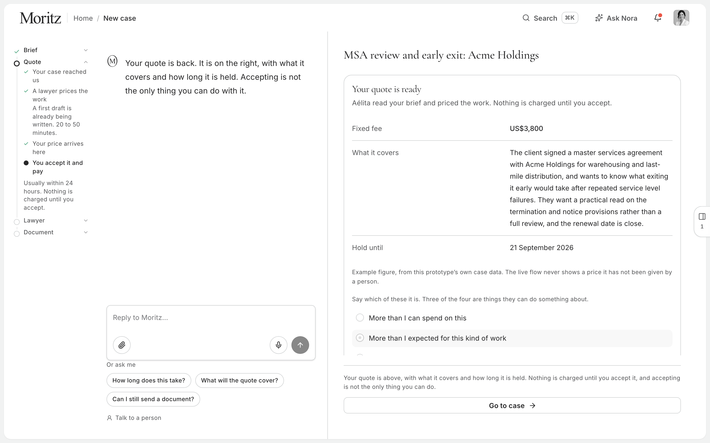

- The no-quote screen: a product decision, not an error. Every reason says
  what is possible instead.

  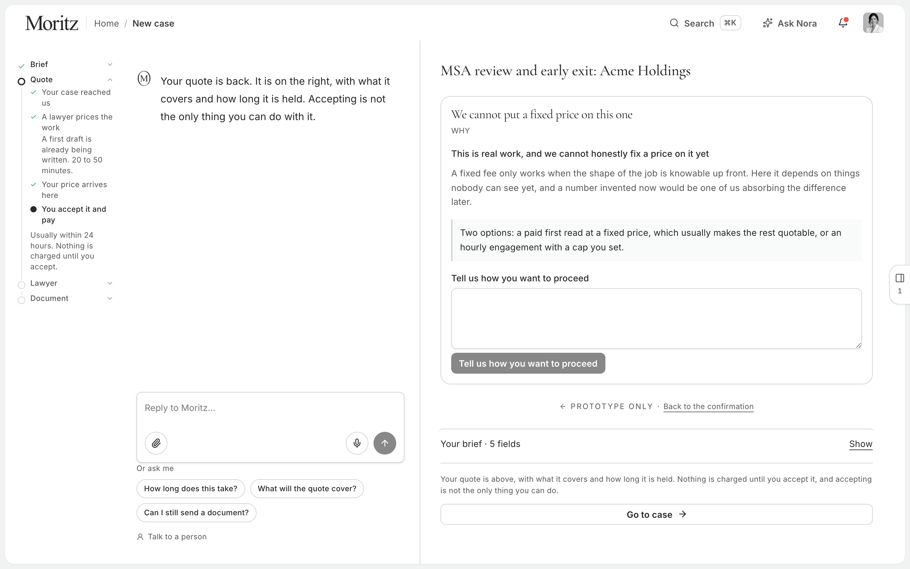

- Notifications: case received (no face; it was your action) and quote ready
  (the lawyer's face; a person wrote it).
- Ask Nora, ⌘J: a question box scoped to your own cases and documents. It
  answers; it never acts.
- _Go to case_ opens the case this submission created, on the existing case
  page, unchanged.

## Everywhere

- Your palette only: twenty greys, black, white, green, red, yellow, sky,
  gold. Guard tests fail the build on any colour that is not one of yours,
  any fourth corner radius, any font size off your scale.
- Green, amber and red mark with your colours as they are. The words beside
  them use a text-weight version of each hue — darkened until it clears
  4.5:1 — so the state stays in colour and still reads.
- Keyboard-complete, with visible focus on everything including the composer.
  Landmarks, one heading per screen, live regions where things change.
- 320px to 2560px, walked on seven screens. A tablet layer at 768–1024. No
  horizontal scroll anywhere, including at 200% zoom.
- Every animation has a reduced-motion fallback. One ambient motion on the
  page — the current step's halo — and nothing else loops.
- Seven kinds of failure, each with its own honest sentence, and retry only
  where retry can succeed. No provider strings reach the client.

---

# Part B — The detail behind each decision

## B1. The half of complaint two that is after the send

Complaint two reads as one sentence and is two questions from two moments.
_How long is this, how many steps, am I nearly done?_ is asked while filling
the thing in, and the brief panel answers it. _I pressed send — what is
happening to my case now?_ is asked afterwards, and nothing answered it.
Your own summary of what the client experiences is the diagnosis: submit, a
quote to pay, silence, a lawyer appears, a document arrives. Three of the
seven steps behind that are invisible by design.

So the rail carries the pipeline as the client can honestly be shown it
(`lib/intake/case-stages.ts`). Three things about it are decisions:

- **Drafting is a line on the pricing row, not a row after payment.** The
  obvious shape was eight sequential rows following the brief's numbering,
  and it was built that way and it was wrong. Your answer corrects it: the
  drafting agent starts straight away, twenty to fifty minutes, and a lawyer
  is assigned once the quote is paid. Drafting runs _alongside_ the quote,
  inside the window the client experiences as silence. That turns "what is
  happening during those 24 hours" from "we are preparing your quote" into
  "a draft of your document already exists" — the single most valuable
  sentence available on that screen.
- **A row is done only where the client's screen has evidence of it**, and
  nothing in the rail is driven by a clock. The reference product the brief
  points at has a top bar reading "Uploading" across five screens and
  twenty-nine minutes of footage and never resolves. A rail advancing on a
  timer would be that defect with better typography — and worse, because it
  would be a law firm telling a client their document had been drafted when
  nobody had opened the file.
- **The quote is three rows, not one** — we price it, you get a price, you pay
  — because it is the only step the client drives. The three rows after
  acceptance fold away behind one click: somebody deciding whether to spend
  money is entitled to see the process, and it is not yet what they came to
  find out.

## B2. Things added that the brief did not ask for, and I would defend

- **The quote sentence.** The flow hands the client into a commercial step
  and says nothing about it. You named the gap. Every surface now says a
  lawyer prices the work and a fixed quote comes back within 24 hours, and
  none of them implies a lawyer is next.
- **Confusion handling.** In the flow this replaces, "I don't understand what
  you mean" was recorded as the answer and then used as the case title. It
  now produces zero field updates. Measured against the live API with three
  confused messages in a row, because the interesting failure is a model that
  holds the line once and gives up.
- **A named way out, on every screen, and a face that answers.** One quiet
  control under the composer, _Talk to a person_; the same dialog from the
  lawyer's card, naming them. What the client writes goes onto the case
  transcript, the channel the whole intake already travels on — and it does
  not start a model turn, because a reply to "I would rather explain this on
  a call" is the software arguing with someone who has just said it is not
  enough. It is the one permanent control in the flow, and deliberately the
  only one. An exit is not a mode.
- **A written limit on how much of a client's document this will ever show.**
  A verified quote earns the sentence it sits in and one either side; it does
  not earn a page. That holds on screen, in the JSON crossing the wire, and
  in any screenshot. A scanned page through OCR has no sentence boundaries,
  so there is a character cap that cuts on a word and says it cut.
- **Telling the client what the microphone costs.** Dictation uses the
  browser's own recognition, which in Chrome sends audio to the vendor. On a
  screen where someone is describing a confidential dispute that is worth
  saying, so it is said, while the mic is running.
- **The four-state field**, from Legora, which you named as the reference.
- **A flow that completes on the keyboard.** Tabbed end to end. It turned up
  four focus rings that rendered nothing and two phantom tab stops; the
  composer — the one control the whole flow runs through — had no focus
  indication at all.

## B3. The concierge — one change to how you work

You wrote: "the client does not see the agent again after submission. From
that point only our Ops team and the assigned lawyer speak to them." The
agent is kept alive after submission, on purpose.

The client is told a price comes back within 24 hours, and in the current
flow the one live control on that screen — the composer — was still there
and still wired to the interviewer. A client asking "how long does this
take?" got an agent asking about their notice period, and anything it
proposed was dropped on arrival, because the brief is sealed.

So there are two prompts (`lib/intake/waiting-prompt.ts`). The second
collects nothing, has a closed list of facts, and is told what to do when a
question falls outside it: say you do not know, and offer the person. It
refuses to quote, estimate, or assess the matter — the two things a client
with nothing to do but wait is most likely to ask, and the two refusals a
test pins. It is emphatically not for company. Three tappable questions sit
under the composer, because nobody types into a blank box on a screen that
has just told them they are finished; a test asserts none of them is a
question the prompt must refuse.

Anything said after submission lands on the case transcript, not only in the
browser. Your Ops team and the assigned lawyer still own the conversation
from assignment onward; nothing here reaches past the quote.

## B4. The assumptions, in full

- **One role.** The self-serve client. The other three are downstream
  consumers of what intake produces.
- **The redesign is the default.** No flag. A flag would have meant designing
  two products and shipping the average.
- **The playground is not the product.** You said it is there for the visual
  language, not the flow. The visual language is yours throughout: your
  components, your grey ramp, your serif and sans, every string in
  `messages/en.json`, and every component checked against its own
  `/foundations` page.
- **Your brand guidelines are in the repo** — the `--mz-*` tokens in
  `globals.css` and the foundations pages — and I checked against those,
  not a document. Two things follow. **Green marks and never speaks.** Your
  green measures 2.66:1 on white; the amber 3.73:1; the red 3.57:1. All
  three fail for text. So the mark beside each row uses the colour as it is,
  where 3:1 is the bar and it clears it, and the label beside it uses an
  "ink" version — `color-mix` of the same token toward black until it
  clears 4.5:1 on white and on the gold (green 4.90:1, amber 4.99:1, red
  5.13:1). Guard tests cap how much of each colour the flow may spend. **The serif stays.**
  Legora uses a display serif, roughly one line per screen, and that line is
  the largest thing on it. That is a match with your own reference, not a
  playground habit.
- **The rail folds at 1280px.** At 1280 and up it is its own column. Below,
  it lies down into the sticky bar at the top and opens on a tap. Two
  columns — chat and brief — appear at 1024; between 768 and 1024 the single
  column stops growing and centres. Three columns need a brief wide enough to
  keep values beside labels and a transcript wide enough to read, and 1024
  has room for one of those, not both.
- **Submission is stubbed**, so the wait is manufactured. The gap is not:
  you said the final pass takes a few minutes and the design has to survive
  it. Nine seconds is long enough that a single spinner starts to feel
  wrong, which is the point, and short enough that a reviewer clicking
  through four times does not resent it.
- **Nobody has given a timescale for anything after the quote**, so the rail
  says so once: "only the quote has a time on it. We would rather leave the
  rest without an estimate than guess at one."
- **The bench profiles are the facts you published, and no more.** Name,
  role, credential, school, read off the roster. Not a line in the lawyer's
  own voice, because these are real people and an invented first-person
  sentence attributed to a named lawyer is not a design decision you can
  review, it is a fabrication you would have to retract.
- **Ask Nora stays on the intake screen.** It was off; it is on. The intake
  is the longest and most confusing flow in the product, and the questions a
  client has there are the ones the intake agent is not taking a statement
  about. One rule in one hook decides it for both surfaces, so they cannot
  drift.
- **Go to case lands on the case this submission created.** The fixture is
  purpose-built as just-submitted: no lawyer, no quote, created today. The
  case page is unchanged; its own five-step progress list would need the
  rail's four words, and does not have them.

## B5. What I left out on purpose

- **Slack.** Enterprise-only, and enterprise never sees intake.
- **Payment, the case page, the lawyer's chat.** Steps four onward.
- **The old intake's components.** Unreferenced and left in place — yours to
  remove.
- **Matter types beyond the seeded contract** are wired and load; only
  contract has a seeded document for the demo.
- **The agent-progress translation.** You said the agent replies once and
  then works in the background with nothing visible. Mapping real agent
  events onto client-facing states is the next piece of work, and it is a
  backend change.

## B6. What I read, and what it changed

**Your own how-it-works videos.** The compliance pill in the step 3 video
reads "EU GDPR Complicance". The draft's headings in the same video read
"Liability & Idemnification" — the damaging one, because it is core contract
vocabulary misspelled inside the panel whose job is making the drafting look
precise. Across all 21 video elements there are zero captions and zero
labels; none of the on-screen meaning reaches a screen reader. The hero video
carries a stereo audio track no visitor can hear.

**Legora.** The most useful thing there is a bug. Its top bar says
"Uploading", with a spinner, in all twenty frames I have — five screens, from
2:29 to 18:31 — and never resolves. The product the brief points at has, in
its own demo, exactly the vague-indicator problem the brief complains about.
That is why every wait here is listed, named, and driven by a response.

## B7. What using it found that reading it did not

The last thing I did before each hand-over was drive the real app — a real
matter, the live API, a laptop window and a phone, every phase. It kept
finding things the type checker and 1,600 passing tests could not.

- **The rail was built, correct, and not on the screen.** It rendered below
  the receipt by every argument in the file, and the brief column held
  2,265px of content in 828px of height, so it began at 822 — behind the
  sticky footer. It is now in the left margin, on every screen, from the
  first.
- **Moritz contradicted himself in one bubble.** The count line said "nothing
  left to ask" under a reply ending in a question. Both numbers were right;
  the confidence was not. Extracted to `progress-note.ts` with a test.
- **The first row of the brief said "contract" in lower case**, above "Acme
  Holdings", on the screen that is supposed to read like a document a firm
  would put its name on. Canonicalised for that one field only.
- **A reply ended "(reply only)".** The waiting prompt described a schema the
  model was not handed, and the nearest thing it could do with the
  instruction was say it out loud.
- **The prompt and the rail disagreed about your own pipeline.** Asked how
  long things take, Moritz said "once you accept, work starts" beside a rail
  saying a draft was already being written. Two surfaces, one case,
  contradicting each other in the same viewport. Fixed, with a test that
  reads both.
- **Refresh after Send landed on a blank home.** The restore was written and
  tested and called by nothing. A unit test of a function nobody calls
  passes. The guard is now on the call sites.
- **The demo links, in one tab.** Five documented URLs, each correct alone,
  and a reviewer clicking them in sequence saw the first screen four times.
  A demo link now clears a session left by a different demo link and nothing
  else.

None of these were defects of implementation. Each was a decision that was
right in the file it was written in and wrong once something else existed
next to it, and the only instrument that detects that is a browser.

## B8. The quote — one thing their flow has no design for

Your videos and every frame I have of the reference product agree: the
quote arrives and the only control on it is _approve and start_. That is the
first decision in the journey with money attached, and there is no design
for the client saying anything other than yes.

So `?demo=quote` is that moment with four paths. Accept is first and the
only solid button; a flow that leads with "this seems high" is coaching
people to haggle. **"This seems high"** asks which of four things it is —
no budget at this size, expected less for this kind of work, a cheaper quote
elsewhere, or nothing is wrong and I want to think — and three of them are
briefs for the lawyer's next move. The fourth is deliberately unactionable
and deliberately there; without it a client who wants a day has to
misrepresent themselves. **"Quote me for part of it"** offers the brief's
own filled fields, derived rather than listed, so they cannot go stale.

`?demo=noquote` is the other half. It is a product decision and not an error
screen: no destructive colour, no alert icon, the heading in the same serif
as the brief's title. Every reason says what is possible instead, and a test
fails the build if one does not.

**On the number.** The live flow shows no price. The demo reads one out of
this app's own case fixtures and says on its face that it is an example.

## B9. One thing the model got wrong, and how it is handled

The seeded contract names two companies in the same recital, in the same
format, one sentence apart, and nothing in the document says which is the
client. Handed the client's own sentence ("we signed an MSA with Acme") the
reader gets it right. Handed no words — a real path, because the opening
move never requires any — it picked the first party it read, and Moritz said
it out loud: the client's own company, named to a lawyer as their opponent.

I tightened the prompt first. It did not stop this: the next run made the
same mistake with the sentence present. It is not a rule the reader follows
unreliably; it is a coin it flips.

So the code decides. A value naming the other side only survives a read if
it is traceable to something the client actually said; otherwise it is
withheld and Moritz asks. An empty field costs the client one question. A
wrong one costs them catching us out.

That is the thesis in miniature. The model is good at reading and bad at
knowing what it cannot know, so the code keeps the decisions that have
consequences and the client keeps the last word.

## B10. The tests worth opening

`pnpm verify` runs prettier, eslint with zero warnings, the type checker, and
1,791 tests. A few enforce decisions rather than behaviour:

- `waits.test.ts` — fails if two loading states share a sentence
- `timeline.test.ts` — fails if a step appears that no listed wait produced
- `colour-restraint.test.ts` — fails on any colour that is not one of yours,
  and caps how much of each the flow may spend
- `radii.test.ts` — fails if a fourth corner radius appears
- `type-scale.test.ts` — fails on any font size off your foundations scale
- `verify-source.test.ts` — fails if a quote the verifier accepts cannot be
  located in the document
- `demo-brief.test.ts` — re-reads the real seeded PDF so the demo cannot
  drift into showing a passage the contract does not contain
- `waiting-prompt.test.ts` — fails if the concierge stops refusing to price
  or assess, names a property its schema lacks, or disagrees with the rail
  about when drafting happens
- `case-stages.test.ts` — fails if a rail row is ticked without evidence on
  the client's screen, if more than one row is current, or if _paid_ stops
  preceding _lawyer_
- `one-more-thing.test.ts` — fails if the confirmation asks for something
  the client already gave, or ever asks about money
- `progress-note.test.ts` — fails if the count line promises nothing is left
  to ask while the reply above it is asking
- `sent-reload.test.ts` — fails if the restore-after-Send is written and
  called by nothing, which is exactly how it shipped broken once

Thirteen runs go against the live API, in five files, and all of them are
opt-in: `INTAKE_LIVE_TESTS=1 pnpm test`. They spend real tokens and need a key,
which is why they sit outside the default run rather than inside it. They are
also the only tests here that can tell you whether the _model_ still behaves,
as opposed to whether the code around it does.

`end-to-end.live.test.ts` — T36, five whole intakes, driven turn by turn:

- run 1: a contract and a sentence, the demo path
- run 2: a contract dropped with nothing typed
- run 3: a client who does not understand the question
- run 4: nothing but a vague opening line
- run 5: an off-topic question in the middle of the intake

`gap-questions.live.test.ts` — T13a, what the document is actually worth:

- gets there faster with the contract than without it
- never re-asks a field the document already filled

`observation.live.test.ts` — item 6, the one thing it is allowed to notice:

- notices two facts that genuinely disagree
- stays silent when nothing genuinely disagrees
- does not offer a second one once the slot is spent

`prompt-cache.live.test.ts` — the saving, measured rather than assumed:

- writes the cache on the first turn and reads it on the second

`turn-quality.live.test.ts` — the turn call's request shape, and the one rule a
prompt cannot prove about itself:

- answers a turn with the new effort and thinking params
- never leaves a required gap without a question

The last two are worth a word on why they are live at all. The first asks for
adaptive thinking, `effort: high` and a JSON schema in one request, and every
part of that combination is accepted or rejected by the API rather than by the
compiler — a rejection would be a 400 on the first message of every intake, so
it is worth one real call to know. The second measures the model unaided
against "every turn ends on a question while a required row is empty".
`dead-end.ts` repairs a turn that breaks that rule and its own tests cover the
repair, but a repaired question is the authored fallback and a question the
model wrote is about this client's case. Both are acceptable and one is much
better, so the difference is measured rather than assumed.
