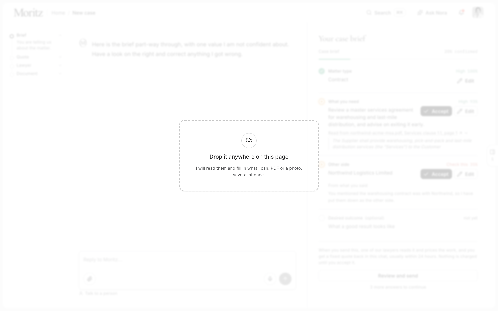
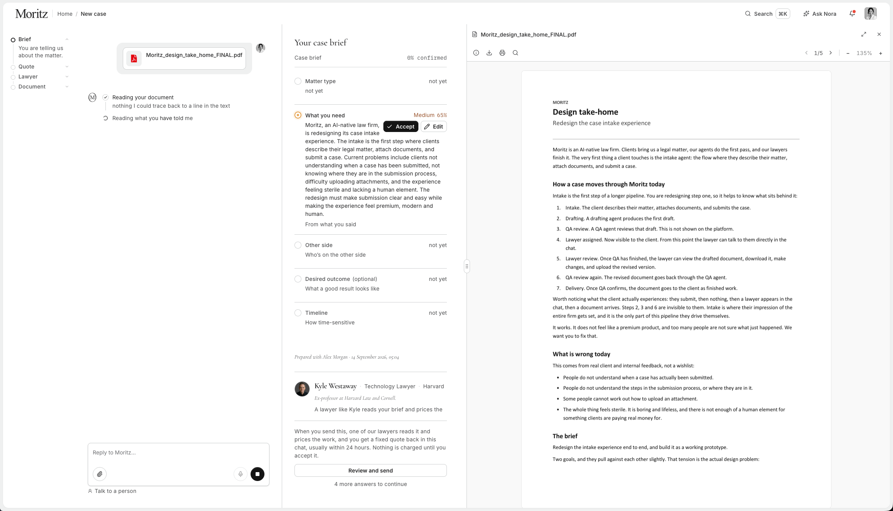
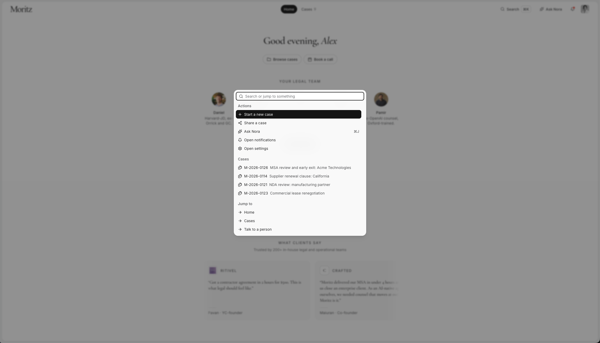
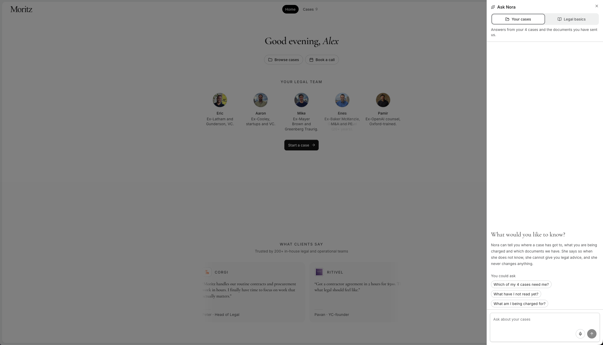
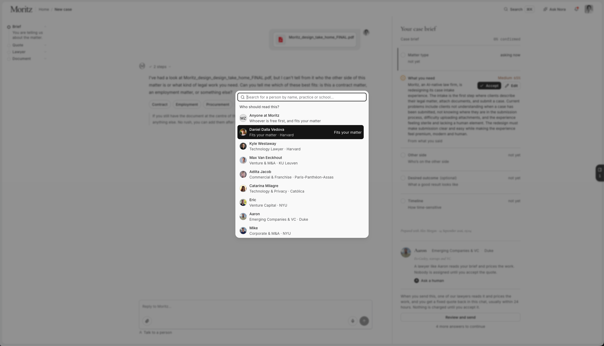
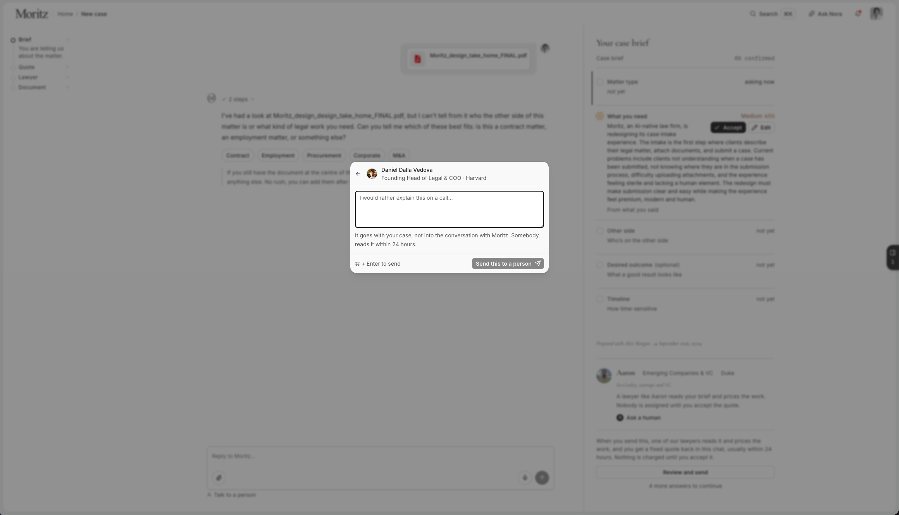

# Introduction

A redesign of the case intake flow for Moritz, an AI-native law firm.
Intake is the first screen a client sees. This is where they describe
their legal problem, attach documents, and send it in. This doc explains
what we built and why, in plain language.

This is a working prototype, not a mockup. You can click through it.

---

## The problem we started with

Clients told us:

- They weren't sure if they had actually submitted their case.
- They didn't know what step they were on, or what came next.
- Some people couldn't figure out how to attach a file.
- The whole thing felt cold. It felt like filling out a form, not talking
to a firm.


## What we changed


### 1. A "How it works" section, up front

Four steps, always visible on the left: **Brief, Quote, Lawyer,
Document**.

```
○ Brief      (you are here)
○ Quote
○ Lawyer
○ Document
```

Before someone commits to typing anything, this same list explains how
the process works:

- **Brief.** Tell us what happened, or drop in the document. Takes a few
minutes.
- **Quote.** A lawyer reads it and puts a fixed price on the work. Within
24 hours.
- **Lawyer.** Accept the price and they take over the chat. As soon as
you accept.
- **Document.** They write it, we check it, you get the finished file.
No fixed estimate.

This answers "what am I getting into?" before the client types a single
word. Once you start typing, the same list turns into a live tracker, so
you always know what's done, what's next, and who's doing it.


### 2. Drag-and-drop file upload

You can drop a document anywhere in the chat box. Drop a PDF and the icon shows up in the PDF's
own red; other file types get their own colour too. This was one of the
biggest complaints (people couldn't find how to upload), so we made it
impossible to miss.



### 3. Human-in-the-loop: Accept and Edit, with a confidence score

Every fact the AI pulls from your document or your message is shown back
to you before it counts as true, along with how confident the AI is
about it (for example, 95% sure vs. 60% sure). A low score is a signal to
look closer before you accept it. You get:

- **Accept.** Confirm the value is correct.
- **Edit.** Correct it yourself if the AI got it wrong.

Nothing moves forward on the AI's word alone, no matter how high the
confidence score is. The client, and later the lawyer, always has the
final say.


### 4. A clearer side panel for reviewing documents

A preview panel on the right lets you see the document you uploaded, or
the draft coming back, without leaving the page or downloading anything
first.



### 5. Command palette (Ctrl+K)

Press **Ctrl+K** (or **Cmd+K** on Mac) anywhere to quickly:

- Start a new case
- Share a case
- Ask Nora
- Open notifications or settings
- Jump straight to any existing case

This is for people who already know what they want and don't want to
hunt through menus.



### 6. Ask Nora: a simple Q&A assistant

A chat panel, separate from the intake conversation, where you can ask
plain questions about your own cases:

- "Which of my 4 cases need me?"
- "What have I not read yet?"
- "What am I being charged for?"



Nora only answers from your case data and the documents you've sent. She
says clearly when she doesn't know something, she never gives legal
advice, and she never changes anything on your behalf. She's read-only.

### 7. Chat with a lawyer

Once a lawyer is assigned, the same chat thread continues with them
directly. No new app, no new link. It's the same conversation the client
has been having the whole time, just with a real person on the other end
now.




### 8. Confirmation, so you know you're actually done

After you submit, you get a clear confirmation: a reference number, a
status, and a note that a copy was emailed to you. The message tells you
that you can close the tab. That only feels honest because the email and
the notification actually exist.


### 9. Progress bar

The progress bar doesn't count "questions answered." It counts **facts
confirmed**. If you upload a contract that already answers four of the
six questions we'd normally ask, the bar jumps ahead immediately. It
reflects what we actually know, not how many boxes are left on a form.


---


## Why these changes

Two things had to both be true at once, and they pull in different
directions:

- **Make it obvious.** A client should never wonder what step they're on
or whether they're done.
- **Make it feel like a real law firm, not a web form.** There are people
behind this. A lawyer's name and face show up early, and stay visible
through the process.

Where a choice made the screen prettier but less clear, we picked clear.