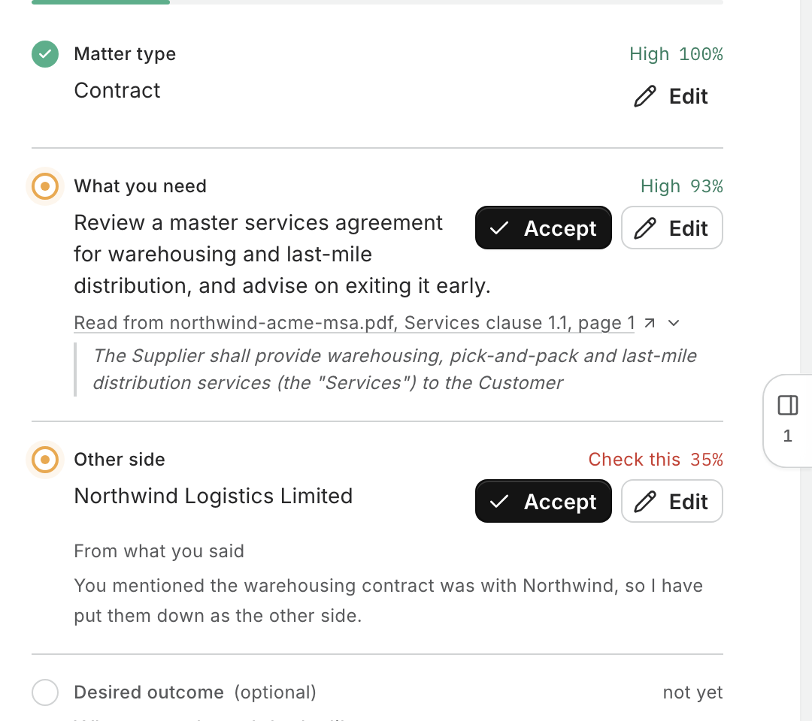
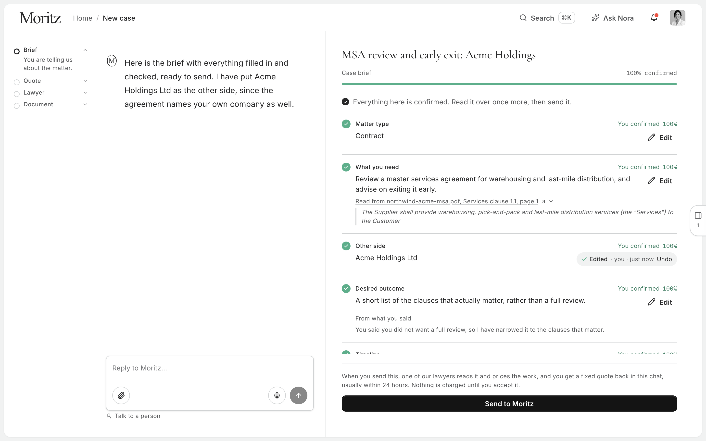
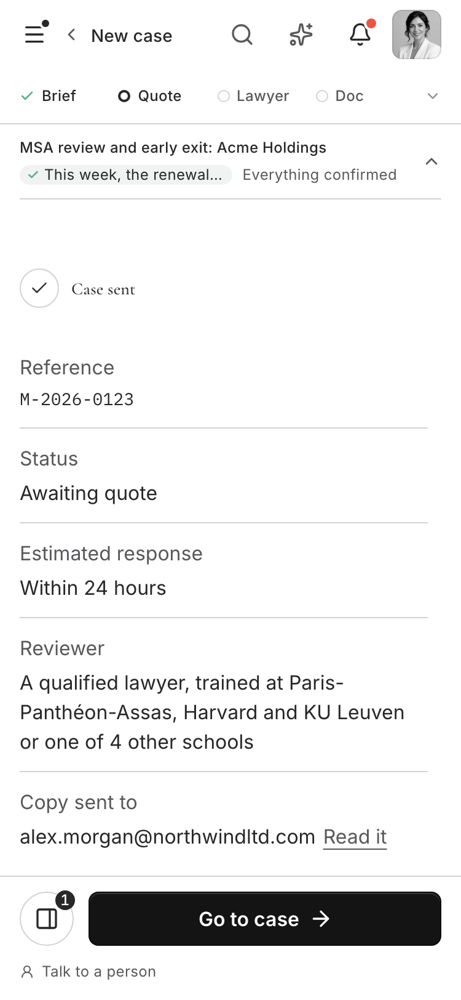

# Five screens, in order

Or skip this and start a case at `/en/client/new`. It is meant to be obvious
without a tour; this is just where to look.

Each link opens that screen directly, in any order, in one tab. They do not
interfere with each other, and a refresh keeps whatever you have done.

---

## 1. Start

`/en/client/new`

One box, in your own words or a dropped file. Under it, how this works: four
steps, who does each, and when. The lawyer who prices this kind of matter is
already on the page, and can be spoken to.

**Notice:** no form. No step numbers. The card at the bottom is the rail
before it starts moving.

## 2. Describe

`/en/client/new?demo=1`

The conversation on the left; the brief filling in on the right. Every fact
appears as it is understood. The four field states are on screen at once:
confirmed, unsure, asking now, not yet.

**Notice:** the rail on the far left has moved with you. The progress bar
counts what you have confirmed, not what you have been asked.

## 3. Confirm

Same screen. Open a row marked _Check this_.

A value read from a document shows the passage it came from, cut from the
PDF's own text, three sentences at most. A value the model inferred shows one
line of why. Nothing leaves until you say it is right.

**Notice:** the mark beside each row is your green, amber or red, exactly.
The words beside it are the same hue darkened to pass contrast, because
your green on its own does not, for text.

## 4. Review and send

`/en/client/new?demo=review`

Everything confirmed, read it once more, send it. Then nine seconds of your
own three steps — checking nothing is missing, writing up the notes, handing
them over — and permission to leave.

**Notice:** the button fills black only when the last field is confirmed.
Press it early and it points at what is missing instead of refusing.

## 5. Sent

`/en/client/new?demo=sent`

A reference number, a status, where the copy was emailed, and the rail's
Quote step opened to show what is happening in the wait: a draft of your
document is already being written. You can close this tab. Further down:
the people who will price it, a drop zone for anything else, and the small
grey _prototype only_ line.

**Notice:** nothing here is on a timer. Every tick has evidence on your own
screen.

---

## Two more, if you want them

**The quote, arriving.** On the Sent screen there is a small grey line near
_Go to case_ marked _prototype only_. Press it and the quote lands in the
chat: what it covers, how long it is held, and four ways to answer instead of
one. `?demo=quote` opens it directly; `?demo=noquote` is the other half, when
a fixed fee is not possible.

**A gap worth asking about.** `?demo=sentgap` is the Sent screen for a case
with no document attached — the one time the agent asks for something after
Send, once, with a reason.

---

**Phone.** Everything above at 375px. The rail lies down into a bar at the
top and opens on a tap; the brief is a sheet you pull up.

**Without an API key.** The flow runs on a scripted fallback and says so.
With one, it is the live model.
